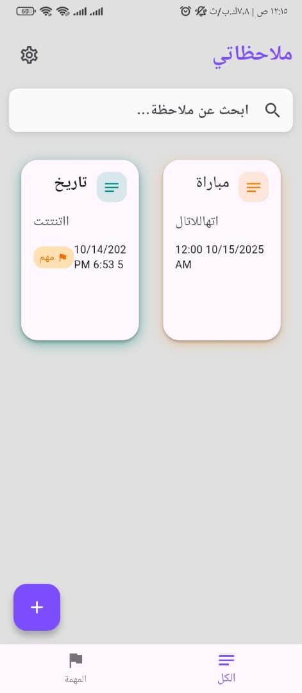
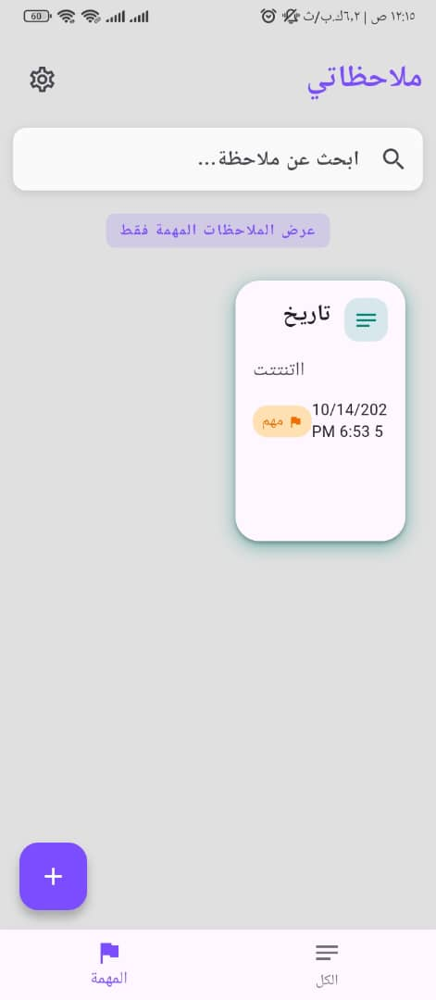
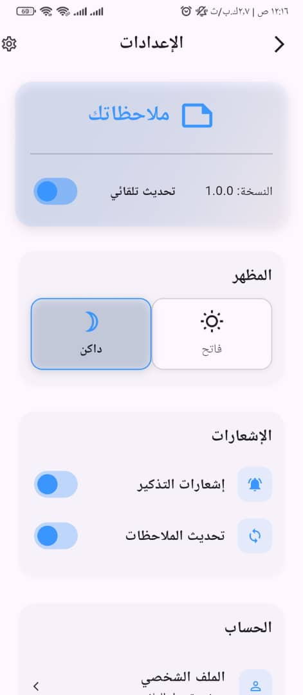

# 📝 Notes App
**Flutter-based Notes App with SQLite**

---

## 🏠 Overview
**Notes** is a modern Flutter application that allows users to manage their notes efficiently.  
You can **add, edit, delete, and search notes**, mark important notes, and view them in a separate "Important" page.  
The app also supports **Dark and Light themes** for comfortable usage.

---

## ✨ Features
- 📝 **Add Notes**: Create new notes with title and description.  
- ✏️ **Edit Notes**: Modify existing notes anytime.  
- ❌ **Delete Notes**: Remove notes you no longer need.  
- 🔍 **Search & Filter**: Find notes easily using search or category filters.  
- ⭐ **Mark as Important**: Highlight important notes and view them in a separate page.  
- 🌙 **Dark & Light Mode**: Switch between light and dark themes for a better experience.  
- 💾 **Offline Storage**: All notes are stored locally using SQLite database.  

---

## 🖼️ Screenshots
*(Place your screenshots inside `assets/screenshots/` folder)*

### Home Screen


### Add Note Screen


### Important Notes Screen


### Setting Notes Screen


### Dark Mode


---

## 🚀 Getting Started

### Prerequisites
- **Flutter SDK** 3.6 or higher  
- **Dart SDK** 3.1 or higher (comes with Flutter 3.6+) 
- Android Studio / VS Code  
- Android emulator or physical device

## 🚀 Installation

1. **Clone the repository**
```bash
git clone https://github.com/jamaljmeel/notes.git
Navigate to the project folder


cd notes
Install dependencies


flutter pub get
Run the application

flutter run
📂 Project Structure

lib/
├── data/          # Note data models & Theme
├── screens/       # App screens 
├── components/    # Reusable UI components
├── services/      # SQLite database helper classes & sharedPref
└── main.dart      # App entry point
assets/
└── screenshots/   # Screenshots for README
🧠 Technologies Used
Frontend: Flutter

Backend / Database: SQLite (local storage)

Languages: Dart

State Management: Provider / setState

🤝 Contributing
Contributions are welcome!

Fork the repository

Create a feature branch


git checkout -b feature/AmazingFeature
Commit your changes


git commit -m "Add some AmazingFeature"
Push to the branch


git push origin feature/AmazingFeature
Open a Pull Request

📄 License
This project is licensed under the MIT License.
See the LICENSE file for details.

💬 Support
If you encounter any issues or suggestions, open an Issue on GitHub
or contact via email:
📧 jmal774583030@gmail.com

Notes App — Organize your notes efficiently and stay productive 📝
